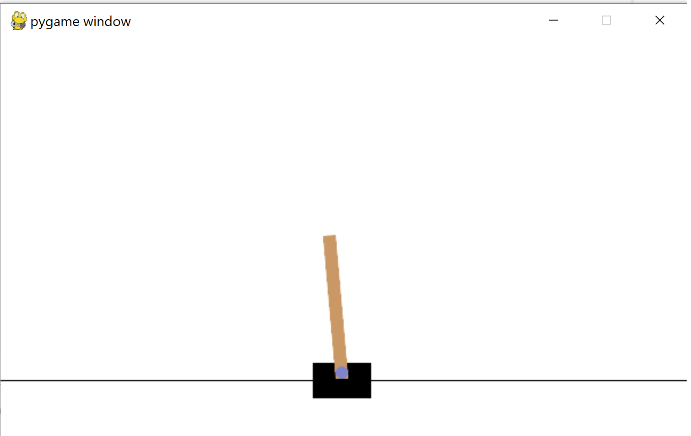
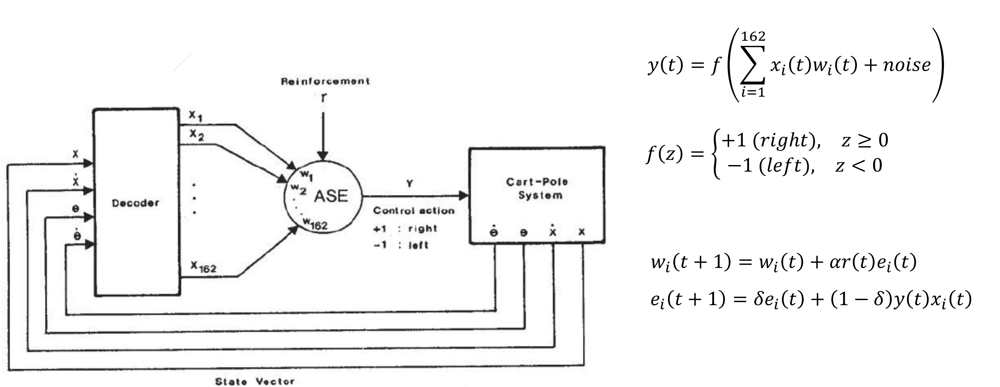
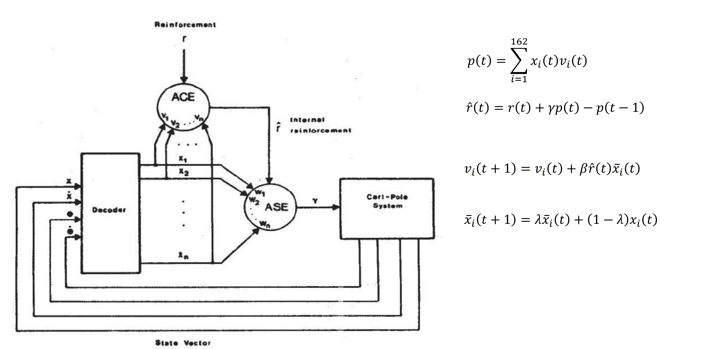

## Cartpole V1
This folder contains scripts to solve the OpenGym CartPole problem.

Initial version is by following book RL from Sutton and Barto.

Advanced version is by following book RL from Sutton and Barto.
It has the r_hat which is improved reinforcement signal.

